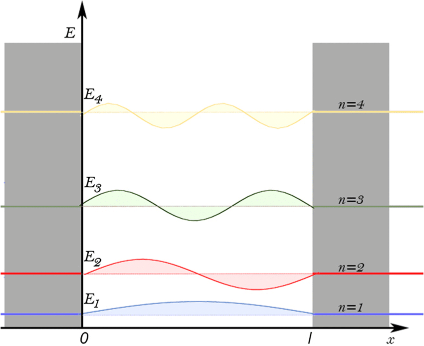
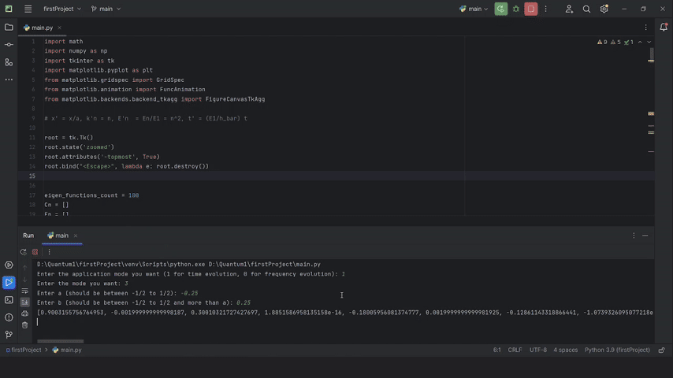
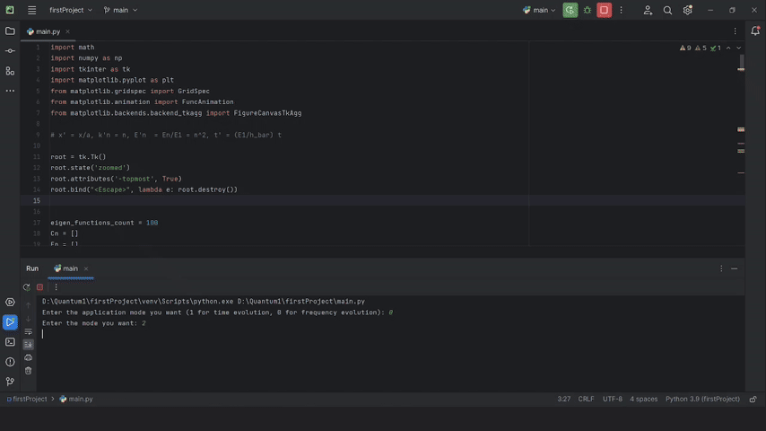

# Particle in a Box Simulation

## Table of Contents
- [Overview](#overview)
- [Theoretical Background](#theoretical-background)
  - [Schrödinger Equation](#schrödinger-equation)
  - [Potential Function](#potential-function)
  - [Bound States](#bound-states)
  - [Eigenfunctions and Eigenvalues](#eigenfunctions-and-eigenvalues)
- [Features](#features)
- [Installation](#installation)
- [Visualization](#visualization)
- [Usage (Time Evolution)](#usage)
  - [Running the Simulation](#running-the-simulation)
  - [Input Modes](#input-modes)
- [Usage (Frequency Evolution)](#usage-2)
- [Dependencies](#dependencies)
- [Code Structure](#code-structure)
- [License](#license)

## Overview

This project is a Python-based simulation of the **Particle in a Box** problem, a fundamental concept in quantum mechanics. It models the time evolution of a quantum particle confined within a one-dimensional box, allowing users to explore different initial states and observe how these states evolve over time. The simulation provides visual insights into the behavior of quantum systems, making it an excellent educational tool for students and enthusiasts of quantum physics. Also, this project contains a code that animates the $\psi\(x, 0\)$ approximated by $\ket{\psi_n}$ s as the bound states are progressively increased.

## Theoretical Background

### Schrödinger Equation

The foundation of this simulation lies in the **Schrödinger equation**, which describes how the quantum state of a physical system changes over time:

$$i\hbar \frac{\partial \Psi(x, t)}{\partial t} = \hat{H} \Psi(x, t)$$

where:
- $\( i \)$ is the imaginary unit,
- $\( \hbar \)$ is the reduced Planck's constant,
- $\( \Psi(x, t) \)$ is the wave function of the particle,
- $\( \hat{H} \)$ is the Hamiltonian operator.

### Time Indepented Schrödinger Equation

By seperating $\Psi(x, t)$ in two parts ( $\psi(x) and \phi(t)$ ) we will end up with the time independent Schrödinger Equation which helps us in solving the equation:

$$
\left[ -\frac{\hbar^2}{2m}\frac{d^2}{dx^2} + V\(x\) \right]\psi\(x\) = E_n\psi\(x\)
$$

$$
i\hbar\frac{d}{dt}\phi\(t\) = E_n\phi\(t\) \implies \phi\(t\) = e^{\frac{-i}{\hbar}E_nt}
$$

### Potential Function

For the **Particle in a Box** problem, the potential $\( V(x) \)$ is defined as:

$$
V(x) = 
\begin{cases} 
0 & \text{for } \frac{-a}{2} < x < \frac{a}{2} \\
\infty & \text{otherwise}
\end{cases}
$$

This represents an infinitely deep potential well where the particle is confined between $\( x = 0 \) and \( x = L \)$.

### Bound States

Within the confines of the box, the particle can only occupy specific energy levels known as **bound states**. These states are quantized, meaning the particle can only have certain discrete energy values.

### Eigenfunctions and Eigenvalues

The solutions to the Schrödinger equation for this system are the **eigenfunctions** $\( \psi_n(x) \)$ and **eigenvalues** $\( E_n \)$:

$$
\psi(x) = 
\begin{cases}
\sqrt{\frac{2}{L}} \sin\left(\frac{n\pi x}{L}\right) & \text{for even n} \\ \\ \\
\sqrt{\frac{2}{L}} \cos\left(\frac{n\pi x}{L}\right) & \text{for odd n}
\end{cases}
$$

$$
E_n = \frac{n^2 \pi^2 \hbar^2}{2mL^2}
$$

where:
- $\( n \)$ is the quantum number,
- $\( m \)$ is the mass of the particle.
- $\( L \)$ is the width of the box which in this case is $\( a \)$

These eigenfunctions form an orthonormal basis, allowing any initial wave function $\( \Psi(x, 0) \)$ to be expressed as a linear combination of $\( \psi_n(x) \)$:



## Features

- **Time Evolution:** Visualize how different initial states evolve over time within the potential well.
- **Multiple Initial States:** Choose from various predefined initial wave functions or define custom ones.
- **Eigenstate Analysis:** Examine the contributions of different eigenstates to the overall wave function.
- **Interactive Visualization:** Real-time plots displaying the real and imaginary parts of the wave function, as well as the probability density.
- **Animation:** Dynamic animations showing the evolution of the wave function and probability density.

## Installation

Ensure you have Python 3.x installed on your system. Follow the steps below to set up the simulation environment:

1. **Clone the Repository:**
   ```bash
   git clone https://github.com/yourusername/particle-in-a-box-simulation.git
   cd particle-in-a-box-simulation
   ```

2. **Create a Virtual Environment (Optional but Recommended):**
   ```bash
   python -m venv venv
   source venv/bin/activate  # On Windows: venv\Scripts\activate
   ```

3. **Install Dependencies:**
   ```bash
   pip install numpy matplotlib tkinter
   ```
## Visualization

The simulation provides several real-time plots:

1. **Cn Coefficients:**
   - Displays the magnitude of the coefficients $\( C_n \)$ for each eigenstate, illustrating their contribution to the overall wave function.

2. **Initial Wave Function $(\( \Psi(x, 0) \))$:**
   - Shows the chosen initial state of the particle within the box.

3. **Real Part of $\( \Psi(x, t) \)$:**
   - Visualizes the real component of the wave function as it evolves over time.

4. **Imaginary Part of $\( \Psi(x, t) \)$:**
   - Visualizes the imaginary component of the wave function as it evolves over time.

5. **Probability Density $(\( \Psi^*(x, t)\Psi(x, t) \))$:**
   - Illustrates the probability distribution of finding the particle at position $\( x \)$ and time $\( t \)$.

## Usage

### Running the Simulation

Execute the Python script to start the simulation:

```bash
python particle_in_box.py
```

### Input Modes

Upon running the script, you will be prompted to select the simulation mode and define the initial state.

1. **Select Application Mode:**
   - **1**: **Time Evolution Mode** - Simulates how the wave function evolves over time.
   - **0**: **Frequency Evolution Mode** - Analyzes the frequency components of the initial wave function.

   *Example Input:*
   ```
   Enter the application mode you want (1 for time evolution, 0 for frequency evolution): 1
   ```

2. **Select Initial State:**
   - **0**: **Stationary State** - Choose a specific quantum number $\( n \)$ for a stationary eigenstate.
   - **1**: **Linear Combination (Function 1)** - A predefined linear combination of eigenstates.
   - **2**: **Linear Combination (Function 2)** - Another predefined linear combination.
   - **3**: **Custom Function** - Define a custom initial wave function within a specified interval.

   *Example Input:*
   ```
   Enter the mode you want: 3
   ```

   For **Custom Function (mode 3)**:
   ```
   Enter a (should be between -1/2 to 1/2): -0.25
   Enter b (should be between -1/2 to 1/2 and more than a): 0.25
   ```

   


## Usage 2

Execute the Python script to start the simulation:

```bash
python particle_in_box.py
```
1. **Select Application Mode:**
   ```
   Enter the application mode you want (1 for time evolution, 0 for frequency evolution): 0
   ```

2. **Select Initial State:**
   - **0**: **Stationary State** - Choose a specific quantum number $\( n \)$ for a stationary eigenstate.
   - **1**: **Linear Combination (Function 1)** - A predefined linear combination of eigenstates.
   - **2**: **Linear Combination (Function 2)** - Another predefined linear combination.
   - **3**: **Custom Function** - Define a custom initial wave function within a specified interval.
  
   *Example Input:*
   ```
   Enter the mode you want: 2
   ```

   


## Dependencies

The simulation relies on the following Python libraries:

- **math**: Mathematical functions.
- **numpy**: Numerical operations and array handling.
- **tkinter**: GUI toolkit for Python.
- **matplotlib**: Plotting and visualization.
- **matplotlib.animation.FuncAnimation**: For creating animations.
- **matplotlib.backends.backend_tkagg.FigureCanvasTkAgg**: Integrating Matplotlib with Tkinter.

Ensure all dependencies are installed via `pip` as outlined in the [Installation](#installation) section.

## Code Structure

The main script `particle_in_box.py` comprises several key components:

1. **Imports and Initialization:**
   - Imports necessary libraries.
   - Sets up the Tkinter root window.

2. **Global Variables:**
   - Defines constants and arrays for eigenfunctions, coefficients, energies, and time steps.

3. **Function Definitions:**
   - **func0 to func3:** Define different initial wave functions.
   - **integrate:** Calculates the coefficients $\( C_n \)$ by integrating the product of the initial wave function and eigenfunctions.
   - **normalize_coefs:** Normalizes the coefficients to ensure the total probability is 1.
   - **Psi_n:** Constructs the time-dependent wave function for a given eigenstate.
   - **animate_1 and animate_0:** Handle the animation for time evolution and frequency evolution modes, respectively.

4. **User Input Handling:**
   - Prompts the user to select the simulation mode and define the initial state.

5. **Simulation Execution:**
   - Depending on the selected mode, calculates coefficients, normalizes them, and sets up the visualization using Matplotlib and Tkinter.

6. **Visualization:**
   - Creates plots for coefficients $\( C_n \)$, initial wave function, real and imaginary parts of $\( \Psi(x, t) \)$, and probability density.
   - Animates the evolution of the wave function over time or frequency components.

## License

This project is licensed under the [MIT License](LICENSE).

---

**Note:** Ensure that the Tkinter library is properly installed and configured on your system, as it is essential for the GUI components of this simulation.

# Acknowledgements

This simulation is inspired by fundamental concepts in quantum mechanics and aims to provide an interactive learning experience for those interested in exploring the quantum behavior of particles in confined systems.

# Contact

For any questions or suggestions, please contact [your.email@example.com](amirarsalan.sanati81@gmail.com).
